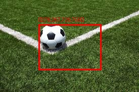
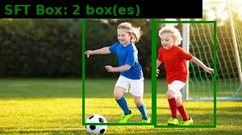
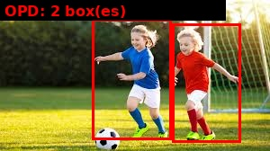

# Thinking with Visual Primitives — PyTorch 实现

<p align="center">
    <a href="https://huggingface.co/yunfengwang"></a>
    <a href="https://huggingface.co/datasets/yunfengwang/TVP-Training-Data"></a>
    <a href="https://arxiv.org/abs/2506.00000"></a>
    <a href="README.md"></a>
</p>

<p align="center">
    <a href="https://huggingface.co/yunfengwang/TVP-OPD-Qwen2VL-2B">OPD 统一模型</a> |
    <a href="https://huggingface.co/yunfengwang/TVP-SFTBox-Qwen2VL-2B">SFT Box 专家</a> |
    <a href="https://huggingface.co/yunfengwang/TVP-SFTPoint-Qwen2VL-2B">SFT Point 专家</a> |
    <a href="https://huggingface.co/yunfengwang/TVP-Pretrain-Qwen2VL-2B">预训练</a> |
    <a href="https://huggingface.co/datasets/yunfengwang/TVP-Training-Data">训练数据</a>
</p>

> 非官方 PyTorch 复现 [*Thinking with Visual Primitives*](https://arxiv.org/abs/2506.00000)。

本项目实现了一个多阶段训练流水线，教会多模态大语言模型使用**边界框**和**点**作为一等"思维单元"——在思维链中交错嵌入空间坐标，以弥合视觉推理中的**参考鸿沟（Reference Gap）**。

## 概览

```
阶段 1: 预训练          — 学习输出视觉原语格式
阶段 2: 专项 SFT        — 专家微调（Box 专家 + Point 专家）
阶段 3: 在线策略蒸馏     — 将两个专家蒸馏为统一模型
```

模型输出带有嵌入坐标的结构化思维：

```
1. Analyzing the request
The user asks me to locate the cat in this image.
2. Object grounding
I see a <|ref|>cat<|/ref|><|box|>[[370,334,408,497]]<|/box|>.
3. Conclusion
The cat is located at the specified coordinates.
```

## 模型

| 模型 | HuggingFace | 说明 |
|------|-------------|------|
| 预训练 | [yunfengwang/TVP-Pretrain-Qwen2VL-2B](https://huggingface.co/yunfengwang/TVP-Pretrain-Qwen2VL-2B) | 学会视觉原语格式的基座模型 |
| SFT Box 专家 | [yunfengwang/TVP-SFTBox-Qwen2VL-2B](https://huggingface.co/yunfengwang/TVP-SFTBox-Qwen2VL-2B) | Grounding 专家（计数、空间推理） |
| SFT Point 专家 | [yunfengwang/TVP-SFTPoint-Qwen2VL-2B](https://huggingface.co/yunfengwang/TVP-SFTPoint-Qwen2VL-2B) | Pointing 专家（迷宫、路径追踪） |
| OPD 统一模型 | [yunfengwang/TVP-OPD-Qwen2VL-2B](https://huggingface.co/yunfengwang/TVP-OPD-Qwen2VL-2B) | 最终蒸馏模型（兼具两种能力） |

## 示例结果

我们在相同图片上对比三个训练阶段的完整模型输出。

### 定位任务："Locate the person in the image."

<table>
<tr><th>阶段</th><th>完整输出</th><th>可视化</th></tr>
<tr>
<td><b>预训练</b></td>
<td>

```
<|ref|>Person<|/ref|><|box|>[[480,201,999,999]]<|/box|>
```
无结构化思维，框过大（覆盖大部分图片）。
</td>
<td></td>
</tr>
<tr>
<td><b>SFT Box</b></td>
<td>

```
1. **Analyzing the request**
The user asks me to locate the person in this image.
2. **Object grounding**
I see a <|ref|>person<|/ref|><|box|>[[511,208,738,963]]<|/box|>.
3. **Conclusion**
The person is located at the specified coordinates.
The person is located at [[511,208,738,963]].
```
结构化思维，准确定位人物剪影。
</td>
<td></td>
</tr>
<tr>
<td><b>OPD</b></td>
<td>

```
1. **Analyzing the request**
The user asks me to locate the person in this image.
2. **Object grounding**
After carefully scanning the entire image,
I do not see any person present.
3. **Conclusion**
There is no person in this image.
```
已知限制：多任务蒸馏后剪影检测退化（SFT Box 能正确检测）。
</td>
<td></td>
</tr>
</table>

### 定位任务："Locate the sports ball in the image."

<table>
<tr><th>阶段</th><th>完整输出</th><th>可视化</th></tr>
<tr>
<td><b>预训练</b></td>
<td>

```
<|ref|>[[278,267,729,759]]<|/ref|>
```
无标签，tag 使用错误，框过大。
</td>
<td></td>
</tr>
<tr>
<td><b>SFT Box</b></td>
<td>

```
1. **Analyzing the request**
The user asks me to locate the sports ball in this image.
2. **Object grounding**
I see a <|ref|>sports ball<|/ref|><|box|>[[277,244,479,510]]<|/box|>.
3. **Conclusion**
The sports ball is located at the specified coordinates.
The sports ball is located at [[277,244,479,510]].
```
正确标签，紧凑框，完整结构化思维。
</td>
<td></td>
</tr>
<tr>
<td><b>OPD</b></td>
<td>

```
1. **Analyzing the request**
The user asks me to locate the sports ball in this image.
2. **Object grounding**
I see a <|ref|>sports ball<|/ref|><|box|>[[277,244,479,510]]<|/box|>.
3. **Conclusion**
The sports ball is located at the specified coordinates.
The sports ball is located at [[277,244,479,510]].
```
与 SFT Box 质量一致（KL=0.35）。
</td>
<td></td>
</tr>
</table>

### 计数任务："How many people are in the image?"

<table>
<tr><th>阶段</th><th>完整输出</th><th>可视化</th></tr>
<tr>
<td><b>预训练</b></td>
<td>

```
There are two people in the image.
```
正确计数但无边界框。
</td>
<td></td>
</tr>
<tr>
<td><b>SFT Box</b></td>
<td>

```
<|ref|>2<|/ref|><|box|>[[338,121,630,923],[634,154,888,945]]<|/box|>
```
输出计数并为每个人标注边界框。
</td>
<td></td>
</tr>
<tr>
<td><b>OPD</b></td>
<td>

```
<|ref|>2<|/ref|><|box|>[[339,121,629,923],[638,150,889,941]]<|/box|>
```
正确计数并输出 2 个框——与 SFT Box 一致。
</td>
<td></td>
</tr>
</table>

### 计数任务："How many sports balls are in the image?"

<table>
<tr><th>阶段</th><th>完整输出</th><th>可视化</th></tr>
<tr>
<td><b>预训练</b></td>
<td>

```
There are four sports balls in the image.
```
正确计数，无边界框。
</td>
<td></td>
</tr>
<tr>
<td><b>SFT Box</b></td>
<td>

```
There are four sports balls in the image.
```
正确计数（本例未生成框）。
</td>
<td></td>
</tr>
<tr>
<td><b>OPD</b></td>
<td>

```
There are four sports balls in the image.
```
保持正确计数。
</td>
<td></td>
</tr>
</table>

**关键发现：**
- **预训练**阶段学会了视觉原语 token 格式，但框过大，缺少结构化思维
- **SFT Box** 引入结构化思维（分析意图 → 目标定位 → 结论），生成准确的边界框；通过 prompt 模板多样化（3→12 种，含单复数、不同动词），修复了 counting 不出框的问题
- **OPD** 保持 SFT Box counting/grounding 质量，框坐标几乎一致，同时支持基于点的任务（迷宫、路径追踪）
- **Prompt 多样化修复**：将 counting 模板从 3 种扩展到 12 种（含单/复数、"the"/"this"、不同动词），解决了 "How many sports balls are in the image?" 只输出纯文本不出框的问题
- **蒸馏调优**：lr=5e-7 + temperature=1.0 + OPD 仅用正样本 grounding 数据，防止灾难性遗忘
- **neg_ratio 调优**：SFT 阶段将负样本比例从 0.30 降至 0.15，解决过度拒绝

## 快速开始

### 安装

```bash
git clone https://github.com/YOUR_USERNAME/Thinking-with-Visual-Primitives-pytorch.git
cd Thinking-with-Visual-Primitives-pytorch

conda create -n vprim python=3.10 -y
conda activate vprim
pip install -r requirements.txt
```

**环境要求**：Python ≥ 3.9，CUDA ≥ 11.8，GPU 显存 12GB+（已在 RTX 4070 Ti 12GB 上测试通过）。

### Gradio 交互式 Demo

```bash
# 启动交互式 Web Demo（带可视化）
python app.py --model_path outputs/opd/final --load_in_4bit

# 或直接使用 HuggingFace 模型
python app.py --model_path yunfengwang/TVP-OPD-Qwen2VL-2B --load_in_4bit

# 生成公共分享链接
python app.py --model_path outputs/opd/final --load_in_4bit --share
```

上传图片，输入 prompt（如 "Locate the cat"），即可看到模型的结构化推理和边界框可视化。

### 命令行推理

```bash
# 单张图片推理
python scripts/inference_demo.py \
    --model_path outputs/opd/final \
    --image your_image.jpg \
    --prompt "Locate the person in the image."

# 使用 4-bit 量化（节省显存）
python scripts/inference_demo.py \
    --model_path outputs/opd/final \
    --image your_image.jpg \
    --prompt "Locate the person in the image." \
    --load_in_4bit

# 批量推理（JSONL 格式）
python scripts/inference_demo.py \
    --model_path outputs/opd/final \
    --jsonl data/sft/counting/counting_data.jsonl \
    --image_root data/coco/val \
    --max_samples 10
```

### Python API 推理

```python
import torch
from PIL import Image
from model import VisualPrimitiveVLM
from transformers import AutoProcessor

model = VisualPrimitiveVLM.from_pretrained("yunfengwang/TVP-OPD-Qwen2VL-2B", device_map="cuda")
model.eval()
tokenizer = model.tokenizer
processor = AutoProcessor.from_pretrained(
    model.base_model_path, trust_remote_code=True
)

image = Image.open("your_image.jpg").convert("RGB")
messages = [
    {"role": "system", "content": "You are a helpful assistant."},
    {"role": "user", "content": [
        {"type": "image", "image": "your_image.jpg"},
        {"type": "text", "text": "Locate the cat in the image."},
    ]},
]
text = tokenizer.apply_chat_template(messages, tokenize=False, add_generation_prompt=True)
inputs = processor(text=[text], images=[image], return_tensors="pt", padding=True)
inputs = {k: v.to(model.vlm.device) for k, v in inputs.items() if isinstance(v, torch.Tensor)}

with torch.no_grad():
    output_ids = model.vlm.generate(**inputs, max_new_tokens=256, do_sample=False)

new_tokens = output_ids[:, inputs["input_ids"].shape[1]:]
response = tokenizer.batch_decode(new_tokens, skip_special_tokens=False)[0]
print(response)
```

## 完整复现

### 第 1 步：准备数据

```bash
python scripts/prepare_all_data.py \
    --output_dir data \
    --coco_split val \
    --coco_subset 5000 \
    --num_counting 2000 \
    --num_spatial 2000 \
    --num_maze 5000 \
    --num_path 3000
```

该脚本会下载 COCO 2017 val（约 1GB）并生成所有训练数据：

```
data/
├── coco/val/images/                    # COCO 图片
├── pretrain/grounding.jsonl            # 预训练 grounding 数据（~14K）
├── sft/
│   ├── counting/counting_data.jsonl    # 计数任务（含边界框，2K）
│   ├── spatial/                        # CLEVR 风格空间推理（2K）
│   ├── maze/                           # 程序生成迷宫（5K）
│   ├── path/                           # 路径追踪（3K）
│   └── grounding/sft_grounding.jsonl   # 含负样本的 Grounding（10K）
```

然后生成含负样本的 SFT grounding 数据：

```bash
python scripts/generate_sft_grounding_data.py \
    --coco_jsonl data/pretrain/grounding.jsonl \
    --image_root data/coco/val \
    --output data/sft/grounding/sft_grounding.jsonl \
    --neg_ratio 0.30
```

### 第 2 步：预训练

教模型学习输出视觉原语 token（`<|box|>`、`<|point|>`、`<|ref|>`）。

```bash
python pretraining/train_pretrain.py \
    --config configs/pretrain_12g.yaml \
    --output_dir outputs/pretrain
```

| 配置项 | 值 |
|--------|------|
| 基座模型 | Qwen/Qwen2-VL-2B-Instruct |
| LoRA | r=16, alpha=32 |
| 训练轮数 | 3 |
| 有效批次大小 | 2 × 8 = 16 |
| 预计时间（12GB GPU） | 约 1 小时 |

### 第 3 步：专项 SFT

从预训练检查点出发，训练两个专家模型：

```bash
# Box 专家（grounding、计数、空间推理）
python sft/train_sft_box.py \
    --config configs/sft_box_12g.yaml \
    --output_dir outputs/sft_box

# Point 专家（迷宫导航、路径追踪）
python sft/train_sft_point.py \
    --config configs/sft_point_12g.yaml \
    --output_dir outputs/sft_point
```

| 配置项 | Box 专家 | Point 专家 |
|--------|----------|------------|
| 数据 | 10K grounding（7K 正 + 3K 负） | 迷宫 + 路径 |
| LoRA | r=64, alpha=128 | r=64, alpha=128 |
| 训练轮数 | 5 | 5 |
| 预计时间 | 约 2.5 小时 | 约 2.5 小时 |

### 第 4 步：在线策略蒸馏（OPD）

使用前向 KL 散度和任务自适应教师路由，将两个专家蒸馏为统一模型：

```bash
PYTORCH_CUDA_ALLOC_CONF=expandable_segments:True \
python unified/train_opd.py \
    --config configs/opd_12g.yaml \
    --output_dir outputs/opd
```

| 配置项 | 值 |
|--------|------|
| 学生模型 | outputs/pretrain/final |
| 教师模型 | sft_box/final + sft_point/final |
| 损失函数 | 前向 KL + CE（ce_coeff=0.5） |
| 温度 | 1.5 |
| 路由策略 | 任务自适应（box 任务→box 教师，point 任务→point 教师） |
| 训练轮数 | 3 |
| 预计时间 | 约 1.5 小时 |

### 第 5 步：评估

```bash
# 评估计数任务
python evaluation/run_eval.py \
    --model_path outputs/opd/final \
    --task counting \
    --data_path data/sft/counting/counting_data.jsonl \
    --image_root data/coco/val \
    --output outputs/opd/eval_counting.json

# 评估迷宫任务
python evaluation/run_eval.py \
    --model_path outputs/opd/final \
    --task maze \
    --data_path data/sft/maze/maze_data.jsonl \
    --output outputs/opd/eval_maze.json

# 多阶段可视化对比
python scripts/compare_models.py
```

支持的任务类型：`counting`、`spatial`、`maze`、`path`、`all`

## 视觉原语格式

坐标为归一化到 `[0, 999]` 的整数：

```
# 边界框
<|ref|>cat<|/ref|><|box|>[[x1,y1,x2,y2]]<|/box|>

# 多个框
<|ref|>person<|/ref|><|box|>[[130,50,400,800],[500,60,750,790]]<|/box|>

# 点
<|point|>[[x,y]]<|/point|>

# 点序列（路径/迷宫）
<|point|>[[100,200],[150,250],[200,300]]<|/point|>
```

## 项目结构

```
├── configs/                    # 训练配置（*_12g.yaml 适配 12GB 显存）
├── model/
│   ├── vl_model.py             # VisualPrimitiveVLM 封装（PEFT、量化）
│   ├── special_tokens.py       # 视觉原语 token 定义
│   ├── spatial_compression.py  # 3×3 空间压缩模块
│   └── vision_projector.py     # 视觉-语言投影器
├── data/
│   ├── datasets_pretrain.py    # 预训练数据集
│   ├── datasets_sft.py         # SFT 数据集（基于 JSONL）
│   ├── collators.py            # 对话拼接器（仅对 assistant 部分计算损失）
│   └── transforms.py           # 图像变换
├── pretraining/
│   └── train_pretrain.py
├── sft/
│   ├── train_sft_box.py        # Box 专家 SFT
│   └── train_sft_point.py      # Point 专家 SFT
├── rl/
│   ├── grpo_trainer.py         # GRPO 训练器
│   ├── reward_models.py        # 格式/质量/准确率奖励模型
│   ├── train_rl_box.py         # Box 专家 RL（可选）
│   └── train_rl_point.py       # Point 专家 RL（可选）
├── unified/
│   ├── train_opd.py            # 在线策略蒸馏
│   ├── train_rft.py            # 拒绝采样微调（可选）
│   └── generate_rft_data.py
├── evaluation/
│   ├── run_eval.py             # 统一评估入口
│   └── metrics.py              # 任务特定指标
├── scripts/
│   ├── prepare_all_data.py     # 一键数据准备
│   ├── compare_models.py       # 多阶段可视化对比
│   ├── inference_demo.py       # 推理演示
│   ├── generate_maze_data.py   # 程序化迷宫生成
│   ├── generate_path_data.py   # 路径追踪数据生成
│   └── regenerate_data.py      # 用正确归一化重新生成数据
└── utils/
    ├── visualization.py        # 在图片上绘制框/点
    ├── coco_categories.py      # COCO 类别 ID→名称映射
    ├── checkpoint.py           # 检查点保存/加载
    └── logging.py
```

## 显存指南

| GPU 显存 | 配置后缀 | 关键设置 |
|----------|----------|----------|
| 24GB | `*.yaml` | batch=2, LoRA r=128, image_size=448 |
| 16GB | — | batch=1, LoRA r=64, image_size=384 |
| **12GB** | `*_12g.yaml` | batch=1, LoRA r=64, image_size=336, max_length=1024 |

对于 12GB GPU，collator 会在 VL 处理器之前将图片预缩放至 336×336，将视觉 token 控制在约 576 个（原始分辨率下约 1500 个）。建议设置 `PYTORCH_CUDA_ALLOC_CONF=expandable_segments:True` 以减少显存碎片。

OPD 阶段（同时加载 3 个模型）会自动对教师模型使用 4-bit 量化。

## 训练流水线详解

### 预训练
- **数据**：COCO 检测标注 → `<|ref|>label<|/ref|><|box|>[[x1,y1,x2,y2]]<|/box|>`
- **训练**：LoRA 作用于 LLM，冻结 ViT
- **损失**：标准交叉熵（next-token 预测）

### 专项 SFT
两个专家使用结构化思维模板：

| 专家 | 任务 | 原语 | 思维模板 |
|------|------|------|----------|
| Box (FTwG) | 计数、空间推理、Grounding | `<\|box\|>` | 意图分析 → Grounding → 结论 |
| Point (FTwP) | 迷宫、路径追踪 | `<\|point\|>` | DFS 探索 / 路径点序列 |

### 在线策略蒸馏
- **前向 KL** 配合温度缩放：`D_KL(teacher ‖ student)`
- **任务自适应路由**：每个样本仅路由到对应的专家教师
- **CE 正则化**：防止灾难性遗忘（ce_coeff=0.5）

### 可选：GRPO 强化学习
RL 阶段使用组相对策略优化（GRPO），配合三类奖励模型：

| 奖励模型 | 类型 | 说明 |
|----------|------|------|
| 格式 RM | 基于规则 | 验证 `<\|box\|>`/`<\|point\|>` 语法 |
| 质量 RM | 启发式/LLM | 检查冗余、自相矛盾 |
| 准确率 RM | 任务特定 | 计数：指数误差；迷宫：多组件评分；路径：双向轨迹距离 |

## 引用

如果本仓库对您有帮助，请引用我们的实现和原论文：

```bibtex
@software{wang2026tvp_pytorch,
  title={Thinking with Visual Primitives — PyTorch Implementation},
  author={Wang, Weishan},
  url={https://github.com/vra/Thinking-with-Visual-Primitives-pytorch},
  year={2026}
}

@article{lu2026thinking,
  title={Thinking with Visual Primitives},
  author={Lu, Ruijie and Ma, Yiyang and Chen, Xiaokang and others},
  journal={arXiv preprint arXiv:2506.00000},
  year={2026}
}
```

## 许可证

MIT 许可证。详见 [LICENSE](LICENSE)。
